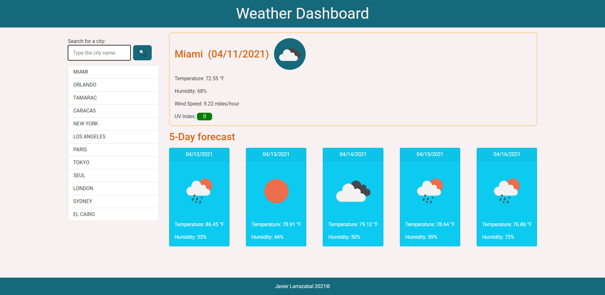

# weather-dashboard

1. Summary: this weather dashboard application uses the Open Weather Map API to look for weather information for any city searched by the user. The information returned is for the current day and time and the forecast for the next 5 days. It also stores the user searches in a list to quickly search for a saved city's weather.

2. Image:

